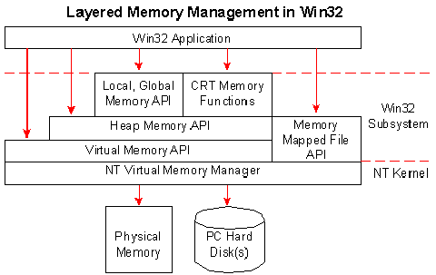

## [SLA, aka. Source-code Annotation Language](https://docs.microsoft.com/en-us/visualstudio/code-quality/using-sal-annotations-to-reduce-c-cpp-code-defects)

--------

## keyword static has three different usage:
1. Make a global variable only visible in single translate unit.
2. Make a variable persist, even in a loop.
3. Make a function only visible inside the translate unit.

---------

## [Entry point](https://msdn.microsoft.com/en-us/library/windows/desktop/ms633559.aspx)
```
int CALLBACK WinMain(
	_In_ HINSTANCE hInstance,
	_In_ HINSTANCE hPrevInstance,
	_In_ LPSTR     lpCmdLine,
	_In_ int       nCmdShow
);
```

### Parameters
`hInstance`: A handle to the current instance of the application  
`hPrevInstance`: A handle to the previous instance of the application. This parameter is always _NULL_.  
`lpCmdLine`: The command line for the application, excluding the program name. To retrieve the entire command line, use the [GetCommandLine](https://msdn.microsoft.com/en-us/library/windows/desktop/ms683156.aspx) function.  
`nCmdShow`: Controls how the window is to be shown.

### Return value
If the function terminates before the message loop, it should return zero.

-------

## [WNDCLASS](https://msdn.microsoft.com/en-us/library/windows/desktop/ms633576.aspx)
Contains the window class attributes that are registered by the _RegisterClass_ function

### Members
1. style: the class style/styles. This member can be any combination of the Class style.
2. lpfnWndProc: A pointer to the window procedure. You must use the CallWindowProc function to call the window procedure.
3. cbClsExtra: The number of extra bytes to allocate following the window-class structure. The system initializes the bytes to zero.
4. cbWndExtra: The number of extra bytes to allocate following the window instance. The system initializes the bytes to zero.
5. hInstance: A handle to the instance that contains the window procedure for the class.
6. hIcon: A handle to the class icon. This member must be a handle to an icon resource. If this member is NULL, the system provides a default icon.
7. hCursor: A handle to the class cursor. This member must be a handle to a cursor resource. If this member is NULL, an application must explicitly set the cursor shape whenever the mouse moves into the application's window.
8. hbrBackground: A handle to the class background brush. This member can be a handle tot the physical brush to be used for painting the background, or it can be a color value.
9. lpszMenuName: The resource name of the class menu, as the name appears in the resource file.
10. lpszClassName: A pointer to a null-terminated string or is an atom.

---------

## [RegisterClassA](https://msdn.microsoft.com/en-us/library/windows/desktop/ms633586.aspx)
```
ATOM WINAPI RegisterClass(
    _In_ const WNDCLASS *lpWndClass
);
```
### Parameters
lpWndClass: A pointer to a WNDCLASS structure. You must fill the structure with the appropriate class attributes before passing it to the function.

### Return Value
If the function succeeds, the return value is a class atom that uniquely indentifies the class being registered.
If the function fails, the return value is zero.

_NOTE_:
```
typedef unsigned short WORD;
typedef WORD ATOM;
```

------------

## [CreateWindow](https://msdn.microsoft.com/en-us/library/windows/desktop/ms632679.aspx)
```
HWND WINAPI CreateWindowEx(
	_In_     DWORD     dwExStyle,
    _In_opt_ LPCTSTR   lpClassName,
	_In_opt_ LPCTSTR   lpWindowName,
	_In_     DWORD     dwStyle,
	_In_     int       x,
	_In_     int       y,
	_In_     int       nWidth,
	_In_     int       nHeight,
	_In_opt_ HWND      hWndParent,
	_In_opt_ HMENU     hMenu,
	_In_opt_ HINSTANCE hInstance,
	_In_opt_ LPVOID    lpParam
);
```
### Parameters
dwExStyle: The extended window style of the window being created.
lpClassName: A null-terminated string or a class [atom](https://stackoverflow.com/questions/10525511/what-is-the-atom-data-type) created by a previous call to the RegisterClass or registerClassEx function. The atom must be in the lower-order word of lpClassName; the high-order word must be zero.
lpWindowName: The window name.
dwStyle: The style of the window being created.
x: The initial horizontal position of the window.
y: The initial vertical position of the window.
nWidth: The width, in device units, of the window.
nHeight: The height, in device units, of the window.
hWndParent: A handle to the parent or owner window of the window being created.
hMenu: A handle to a menu, or specifies a child-window identifier depending on the window style.
hInstance: A handle to the instance of the module to be associated with the window.
lpParam: A pointer to a value to be passed to the window through the `CREATESTRUCT` structure pointed to be the _lParam_ param of the `WM\_CREATE`

### Return Value
If the function succeeds, the return value is a handle to the new window.
If the function fails, the return value if NULL.

---------

## [MSG structure](https://msdn.microsoft.com/en-us/library/windows/desktop/ms644958.aspx)
```
typedef struct tagMSG {
    HWND   hwnd;
	UINT   message;
	WPARAM wParam;
	LPARAM lParam;
	DWORD  time;
	POINT  pt;
} MSG, *PMSG, *LPMSG;
```

### Memebers
hwnd: A handle to the window whose window procedure receives the message. This member is NULL when the message is a thread message.
message: The message identifier. Applications can only use the low word; the high word is reserved by the system.
mParam: Additional information about the message. The exact meaning depends on the value of the `message` member.
lParam: Additional information about the message. The exact meaning depends on the value of the `message` member.
time: The time at which the message was posted.
pt: The cursor position, in screen coordinates, when the message was posted.

---------

## [PeekMessage](https://msdn.microsoft.com/en-us/library/windows/desktop/ms644943.aspx)
```
BOOL WINAPI PeekMessage(
  _Out_    LPMSG lpMsg,
  _In_opt_ HWND  hWnd,
  _In_     UINT  wMsgFilterMin,
  _In_     UINT  wMsgFilterMax,
  _In_     UINT  wRemoveMsg
);
```
Dispatches incoming sent messages, checks the thread message queue for a posted message,
and retrieves the message if any exist.
If a message is available, the return value is nonzero, otherwise, the return value is zero.

## [TranslateMessage](https://msdn.microsoft.com/en-us/library/windows/desktop/ms644955.aspx)
```
BOOL WINAPI TranslateMessage(
    _In_ const MSG *lpMsg
);
```
Translates [virtual-key](https://msdn.microsoft.com/en-us/library/windows/desktop/dd375731.aspx) message into charactor messages. The character messages are posted to the calling thred's message queue, to be read the next time the thread calls the `GetMessage` or `PeekMessage` function.
### Parameters
lpMsg: A pointer to an MSG structure that contains message information retrieved from the calling thread's message queue by using the `GetMessage` or `PeekMessage` function.

## [DispatchMessage](https://msdn.microsoft.com/en-us/library/windows/desktop/ms644934.aspx)
Dispatches a message to a window procedure. It is typically used to dispatch a message retrieved by the **GetMessage** function.
```
LRESULT WINAPI DispatchMessage(
  _In_ const MSG *lpmsg
);
```

## [Device Context](https://msdn.microsoft.com/en-us/library/windows/desktop/dd162467.aspx)
1. Device independence is one of the chief features of Microsoft Windows.
2. Applications can draw and print output on a variety of devices. Two DLL is needed.
3. First: _Gdi.dll_, is referred to as the graphics device interface(GDI)
4. Second: A device driver. It depends on the device application draws on.
5. An application must inform GDI to load a particular device driver, and prepare the device for drawing operations.
6. Tasks in previous line are accomplished by creating and maintaining a device context(DC).
7. A DC is a structure that defines a set of graphic objects and their associated attributes, and graphic modes.
8. An application never has direct access to the DC; instead, it operates on the structure indirectly by calling various function.

## [GetDC](https://msdn.microsoft.com/en-us/library/windows/desktop/dd144871.aspx)
```
HDC GetDC(
  _In_ HWND hWnd
);
```
Retrives a handle to a device context (DC) for the client area of a specified window or for the entire screen.
You can use the returned handle in subsequent GDI functions to draw in the DC.

### Parameters
hWnd: A handle to the window whose DC is to be retrieved. If this value is **NULL**, _GetDC_ retrieves the DC for the entire screen.

------------

## [NEAR and FAR pointers](https://stackoverflow.com/questions/3869830/near-and-far-pointers)
1. Origin in the [segmented memory model](https://superuser.com/questions/318804/understanding-flat-memory-model-and-segmented-memory-model)
2. A near pointer could only access a block of memory originally around 64kb in size called segment.
3. A far pointer could go outside of such range consisting of a setment and offset in that segment.
4. The near pointers **were** much faster than far pointers so therefore in some contexts it paid off to use them.
5. Nowadays with virtual memory, near and far pointers have no use.(Clarify needed)

## [GetClientRect](https://msdn.microsoft.com/en-us/library/windows/desktop/ms633503.aspx)
```
BOOL WINAPI GetClientRect(
  _In_  HWND   hWnd,
  _Out_ LPRECT lpRect
);
```
Retrieves the coordinates of a window's client area.

## [StretchDIBits](https://msdn.microsoft.com/en-us/library/windows/desktop/dd145121.aspx)
```
int StretchDIBits(
  _In_       HDC        hdc,
  _In_       int        XDest,
  _In_       int        YDest,
  _In_       int        nDestWidth,
  _In_       int        nDestHeight,
  _In_       int        XSrc,
  _In_       int        YSrc,
  _In_       int        nSrcWidth,
  _In_       int        nSrcHeight,
  _In_ const VOID       *lpBits,
  _In_ const BITMAPINFO *lpBitsInfo,
  _In_       UINT       iUsage,
  _In_       DWORD      dwRop
);
```
Copies the color data for a rectangle of pixels in a DIB, JPEG, or PNG image to the specified destination rectangle.

## [BITMAPINFO](https://msdn.microsoft.com/en-us/library/windows/desktop/dd183375.aspx)
The **BITMAPINFO** structure defines the dimensions and color information for a [DIB](https://msdn.microsoft.com/en-us/library/windows/desktop/dd183562.aspx)

```
typedef struct tagBITMAPINFO {
  BITMAPINFOHEADER bmiHeader;
  RGBQUAD          bmiColors[1];
} BITMAPINFO, *PBITMAPINFO;
```

## [BITMAPINFOHEADER](https://msdn.microsoft.com/en-us/library/windows/desktop/dd183376.aspx)
A structure contains information about the dimensions and color format of [DIB](https://msdn.microsoft.com/en-us/library/windows/desktop/dd183562.aspx))
```
typedef struct tagBITMAPINFOHEADER {
  DWORD biSize;          // The number of bytes required by the structure
  LONG  biWidth;         // The width of the bitmap, in pixels
  LONG  biHeight;        // The height of the bitmap, in pixels
  WORD  biPlanes;        // The number of planes for the target device. Must be 1.
  WORD  biBitCount;      // The number of bits-per-pixel.
  DWORD biCompression;   // The compression type for a compressed bottom-up bitmap. Top-down cannot be compressed
  DWORD biSizeImage;     // The size of the image, in bytes.
  LONG  biXPelsPerMeter; // The horizontal resolution.
  LONG  biYPelsPerMeter; // The vertical resolution.
  DWORD biClrUsed;       // The number of color index in the color table that are actually used.
  DWORD biClrImportant;  // The number of color indexes that are required for displaying the bitmap.
} BITMAPINFOHEADER, *PBITMAPINFOHEADER;
```

## [VirtualAlloc](https://msdn.microsoft.com/en-us/library/windows/desktop/aa366887.aspx)
Reserves, commits, or changes the state of a region of pages in the virtual address space of the calling process.
Memory allocated by this function is automatically initialized to zero.

```
LPVOID WINAPI VirtualAlloc(
  _In_opt_ LPVOID lpAddress,  // The starting address of the region to allocate.
  _In_     SIZE_T dwSize,     // The size of the region, in bytes.
  _In_     DWORD  flAllocationType, // The type of memory allocation.
  _In_     DWORD  flProtect   // The memory protection for the region of pages to be allocated.
);
```

## [VirtualFree](https://msdn.microsoft.com/en-us/library/windows/desktop/aa366892.aspx)
Release, decommits, or releases and decommits a region of pages within the virtual address space of the calling process.
To free memory allocated in another process by the `VirtualAllocEx` function, use the `VirtualFreeEx` function.

```
BOOL WINAPI VirtualFree(
  _In_ LPVOID lpAddress,
  _In_ SIZE_T dwSize,
  _In_ DWORD  dwFreeType
);
```

### Using CMD to search file
```
dir /s file_name.ext
```

## [Further Reading: Manage Virtual Memory](https://msdn.microsoft.com/en-us/library/ms810627.aspx)


| **Memory Set** |
| Vertual memory functions |
| **System Resource Affected** |
| A process' virtual address space |
| System pagefile |
| System memory |
| Hard disk space |
| **Memory set** |
| Memory-mapped file functions |
| **System Resource Affected** |
| A process' virtual address space |
| System pagefile |
| Standard file I/O |
| System memory |
| Hard disk space |


## [Window Notification](https://msdn.microsoft.com/en-us/library/windows/desktop/ff468922.aspx)
| **Macro** | **Value** | **Description** |
|-----------|-----------|-----------------|
| WM_ACTIVATEAPP | 0x001c | Sent when a window belonging to a different application than the active window is about to be activated |
| WM_CANCELMODE | 0x001f | Sent to cancel certain modes, such as mouse capture |
| WM_CHILDACTIVATE | 0x0022 | Sent to a child window when the user clicks the window's title bar or when the window is activated |
| WM_CLOSE | 0x0010 | Sent as a signal that a window or an application should terminate |
| WM_COMPACTING | 0x0041 | Sent to all top-level windows when the system detects more than 12.5 percent of system time over 30- to 60-second interval is being spent compacting memory. This indicates that the system memory is low. |
| WM_CREATE | 0x0001 | Sent when an application requests that a window be created by calling [CreateWindowEx](https://msdn.microsoft.com/en-us/library/windows/desktop/ms632680.aspx) or [CreateWindow](https://msdn.microsoft.com/en-us/library/windows/desktop/ms632679.aspx) function. The message is sent before the function returns. The window procedure of the new window receives this message after the window is created, but before the window becomes visible |
| WM_DESTROY | 0x0002 | Sent when a window is being destroyed |
| WM_ENABLE | 0x000A | Sent when an application changes the enabled state of a window. |
| WM_ENTERSIZEMOVE | 0x0231 | Sent one time to a window after it enters the moving or sizing modal loop |
| WM_EXITSIZEMOVE | 0x0232 | Sent one time to a window, after it has exited the moving or sizing modal loop |
| WM_GETICON | 0x007f | Sent to a window to retrieve a handle to the large or small icon associated with a window |
| WM_GETMINMAXINFO | 0x0024 | Sent to a window when the size or position of the window is about to change |
| WM_INPUTLANGCHANGE | 0x0051 | Sent to the topmost affected window after an application's input language has been changed |
| WM_INPUTLANGCHANGEREQUEST | 0x0050 | Posted to the window with the focus when the user chooses a new input language |
| WM_MOVE | 0x0003 | Sent after a window has been moved |
| WM_MOVING | 0x0216 | Sent to a window that the user is moving |
| WM_NCACTIVATE | 0x0086 | Sent to a window when its nonclient area needs to be changed to indicate an active or inactive state |
| WM_NCCALCSIZE | 0x0083 | Sent when the size and position of a window's client area must be calculated. |
| WM_NCCREATE | 0x0081 | Sent prior to the WM_CREATE message when a window is first created. |
| WM_NCDESTROY | 0x0082 | Notifies a window that its nonclient area is being destroyed. The [DestroyWindow](https://msdn.microsoft.com/en-us/library/windows/desktop/ms632682.aspx) function sends the WM\_NCDESTROY message to the window following the **WM\_DESTROY** the **WM_DESTROY** is used to free the allocated memory object associated with the window. |
| WM_NULL | 0x0000 | Performs no operation. An application send the WM\_NULL message if it wants to post a message that the recipient window will ignore. |
| WM_QUERYDRAGICON | 0x0037 | Sent to a minimized(iconnic) window. The window is about to be dragged by the user but does not have an icon defined for its class. An application can return a handle to an icon or cursor. The system displays this cursor or icon while the user drags the icon. |
| WM_QUERYOPEN | 0x0013 | Sent to an icon when the user requests that the window be restored to its previous size and position. |
| WM_QUIT | 0x0012 | Indicates a request to terminate an application, and is generated when the application calls the [PostQuitMessage] function. This message causes the [WM_QUIT] to return zero. |
| WM_SHOWWINDOW | 0x0018 | Sent to a window when the window is about to be hidden or shown |
| WM_SIZE | 0x0005 | Sent to a window after its size has changed. |
| WM_SIZING | 0x0214 | Sent to a window that the user is resizing. By processing this message, an application can monitor the size and position of the drag rectangle and, if needed, change its size or position. |
| WM_STYLECHANGED | 0x007D | Sent to a window after the [SetWindowLong] function has changed one or more of the window's style. |
| WM_STYLECHANGING | 0x007C | Sent to a window when the [SetWindowLong] function is about to change one or more of the window's styles. |
| WM_THEMECHANGED | 0x031A | Broadcast to every window following a theme change event. |
| WM_USERCHANGED | 0x0054 | Sent to all windows after the user has logged on or off. |
| WM_WINDOWPOSCHANGED | 0x0047 | Sent to a window whose size, position, or place in the Z order has changed as a result of a call to the [SetWindowPos] function or another window-management function. |
| WM_WINDOWPOSCHANGING | 0x0046 | Sent to a window whose size, position, or place in the Z order is about to change as a result of a call to the [SetWindowPos] function or another window-management function. |

## Message list when an app starts (Based on Day6 code)
0x00000024  WM_GETMINMAXINFO  
0x00000081  WM_NCCREATE  
0x00000083  WM_NCCALCSIZE  
0x00000001  WM_CREATE  
0x00000018  WM_SHOWWINDOW  
0x00000046  WM_WINDOWPOSCHANGING  
0x00000086  N/A  
0x0000007f  N/A  
0x00000006  N/A  
0x00000281  N/A  
0x00000282  N/A  
0x00000007  N/A  
0x00000085  N/A  
0x00000014  N/A  
0x00000047  WM_WINDOWPOSCHANGED  
0x00000005  WM_SIZE  
0x00000003  WM_MOVE  
0x0000007f  N/A  
0x00000088  N/A  
0x0000007f  N/A  
0x0000031f  N/A  
0x0000007f  N/A  
0x0000c12d  N/A  

## [DirectSoundCreate]
```
HRESULT WINAPI DirectSoundCreate(
  LPGUID lpGuid, 
  LPDIRECTSOUND* ppDS, 
  LPUNKNOWN  pUnkOuter 
);
```

### Parameters
_lpGuid_ : Addres of the GUID that identifies the sound device. The value of this parameter must be one of the
GUIDs return by [DirectSoundEnumerate] or **NULL** for the default  
device. 
_ppDS_ : Address of a pointer to a DirectSound object created in response to this function.
_pUnkOuter_ : Controlling unknown of the aggregate. Its value must be NULL.

### Return Value
If the function succeeds, the return value is _DS\_OK_
If the function fails, the return value may be one of the following error values:
| Return Code |
|-------------|
|DSERR_ALLOCATED|
|DSERR_INVALIDPARAM|
|DSERR_NOAGGREGATION|
|DSERR_NODRIVER|
|DSERR_OUTOFMEMORY|
### Remarks
The application must call the `IDirectSound::SetCooperativeLevel` method immediately after creating a _DirectSound_ object.

### HRESULT
The _HRESULT_ is a data type used in Windows operating systems, and the earlier IBM/Microsfot OS/2 operating system, to present error conditions, and
warning conditions.  
It has 32 bits divided into three fields: a severity code, a facility code, and an error code.
Using [`SUCCEEDED`] macro to verify the result

## [Pulse-Code Modulation]
A method used to digitally represent sampled analog signals.

## [WAVEFORMATEX]
It defines the format of waveform-audio data. Only format information common to all waveform-audio data formats is
included in this structure.

## [DSBUFFERDESC]
Describes the characteristics of a new buffer object.
**NOTE:** data memeber lpwfxFormat stands for `long pointer wave format ex Format`

## [CreateSoundBuffer]
Creates a `DirectSoundBuffer` object to hold a sequence of audio samples.

[CreateSoundBuffer]:https://msdn.microsoft.com/en-us/library/mt708943.aspx
[DSBUFFERDESC]:https://msdn.microsoft.com/en-us/library/windows/desktop/microsoft.directx_sdk.reference.dsbufferdesc.aspx
[WAVEFORMATEX]:https://msdn.microsoft.com/en-us/library/windows/desktop/dd390970.aspx
[Pulse-Code Modulation]:https://en.wikipedia.org/wiki/Pulse-code_modulation
[`SUCCEEDED`]:https://msdn.microsoft.com/en-us/library/windows/desktop/ms687197.aspx
[DirectSoundEnumerate]:https://msdn.microsoft.com/en-us/library/microsoft.directx_sdk.reference.directsoundenumerate.aspx
[DiectSoundCreate]:https://msdn.microsoft.com/en-us/library/mt708921.aspx
[SetWindowLong]:https://msdn.microsoft.com/en-us/library/windows/desktop/ms633591.aspx
[SetWindowPos]:https://msdn.microsoft.com/en-us/library/windows/desktop/ms633545.aspx
[PostQuitMessage]:https://msdn.microsoft.com/en-us/library/windows/desktop/ms644945.aspx
[WM_QUIT]:https://msdn.microsoft.com/en-us/library/windows/desktop/ms644936.aspx